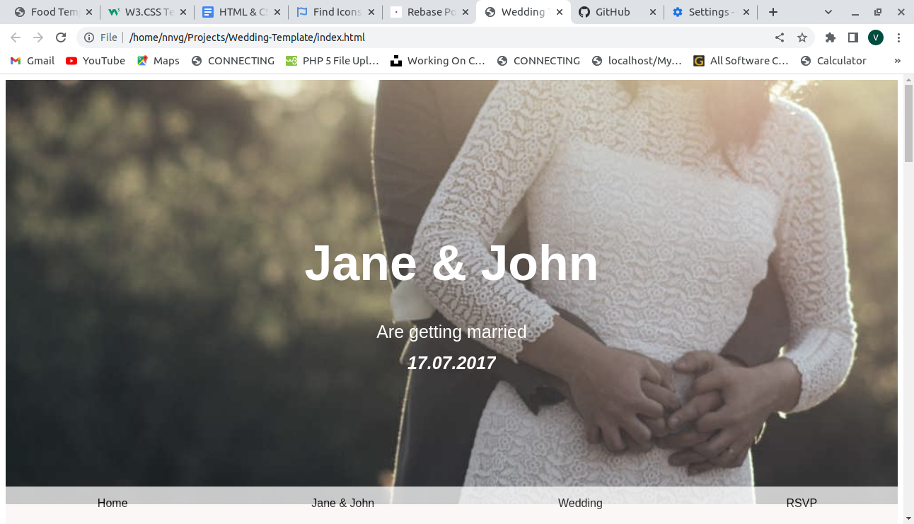
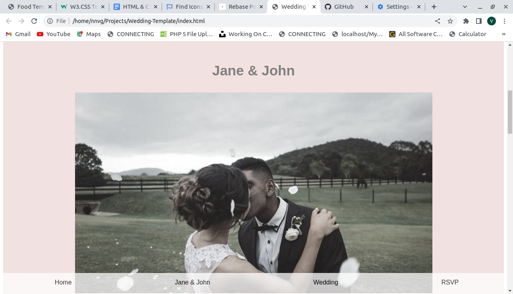

# wedding project

this project is all about online invitation.

## App

### Built With

- HTML
- CSS
### Prerequisites

Knowledge about:

- HTML
- CSS
- Google chrome

## Clone project

- To get a local copy up and running follow these simple example steps.
- Clone this repository with `git@github.com:NoubissiViany/Wedding-Template-Design.git` using your terminal.
- Change to the project directory by entering: cd Wedding-Template in the terminal.

## steps

- $ git clone `git@github.com:NoubissiViany/Wedding-Template-Design.git`
- $ `cd Wedding-Template`
- $ `git checkout feature/navbar`

## Start App

- run by opening the index.html in the browser

## Author

👤 **NoubissiViany**

- GitHub: [@NoubissiViany](github.com/NoubissiViany/Wedding-Template-Design)

## 📝 License

This project is [w3school](./LICENSE) licensed.
